# iot-cpp-2026

## 0306(금)

1. 프로그래밍 언어의 Schema

    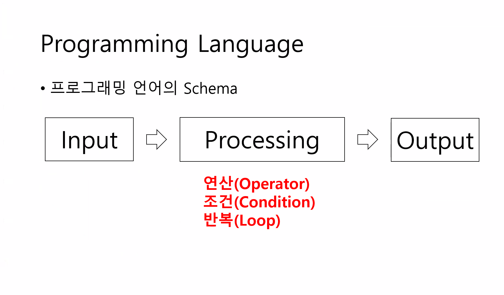

2. Variable(변수): [소스](./Day0306-Solution/basic/01_variable.cpp)
   
    - 변수: 선언 + 초기화 -> 할당

    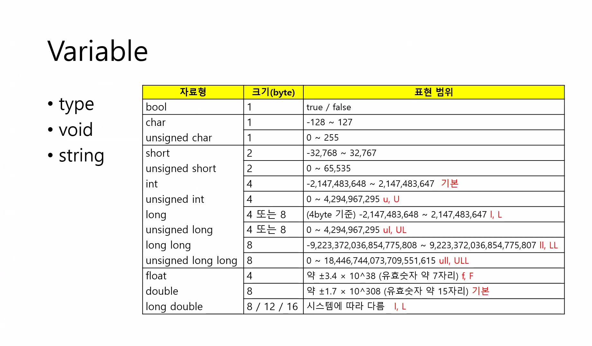

    - C++ 변수/상수 정리

    - 상수 (Constant)
        - 한 번 값이 정해지면 변경할 수 없는 변수
        - 예: const double PI = 3.14; → PI는 항상 3.14

    - 전역변수 (Global Variable)
        - 프로그램 시작 시 자동으로 기본값으로 초기화

        - 초기값 예시:
            - 정수(int) → 0
            - 부동소수점(float, double) → 0.0
            - 불(bool) → false (0)
            - 문자(char) → 0 (NULL)

    - 지역변수 (Local Variable)
        - 자동 초기화되지 않음
        - 사용 전에 반드시 초기화해야 함

        - 초기화하지 않으면 **쓰레기값(garbage value)**이 들어 있음

    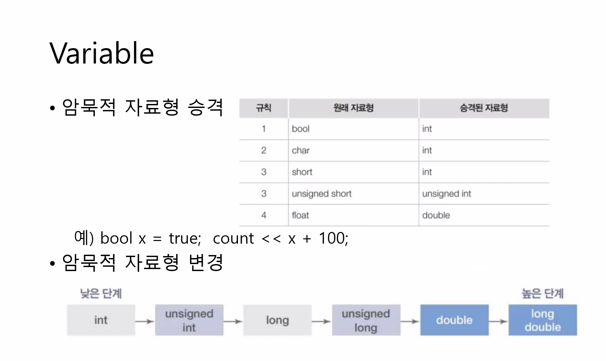

    - 왜 변환을 할까: cpu가 효율적으로 처리할 수 있는 기본 정수 단위가 보통 32비트(int)이기 때문

3. Casting(형변환): [소스](./Day0306-Solution/basic/02_casting.cpp)
    
    - 데이터 타입을 다른 타입으로 바꾸는 것
    - 암묵적: 컴파일러가 자동으로 타입 변환
        - x + y → 자동으로 double로 변환 (암묵적)

    - 명시적: 직접 int로 변환
        - static_cast<int>(x)

4. Processing(연산): [소스](./Day0306-Solution/basic2/03_operator.cpp)

    - 입력 데이터를 가지고 계산, 비교, 논리 판단, 값 변경 등 프로그램이 처리하는 모든 활동

    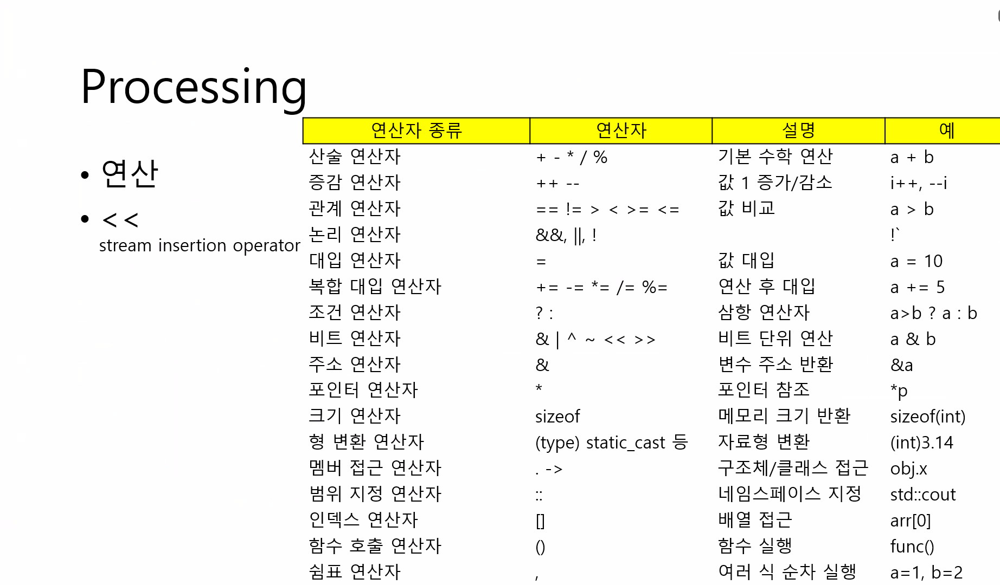

    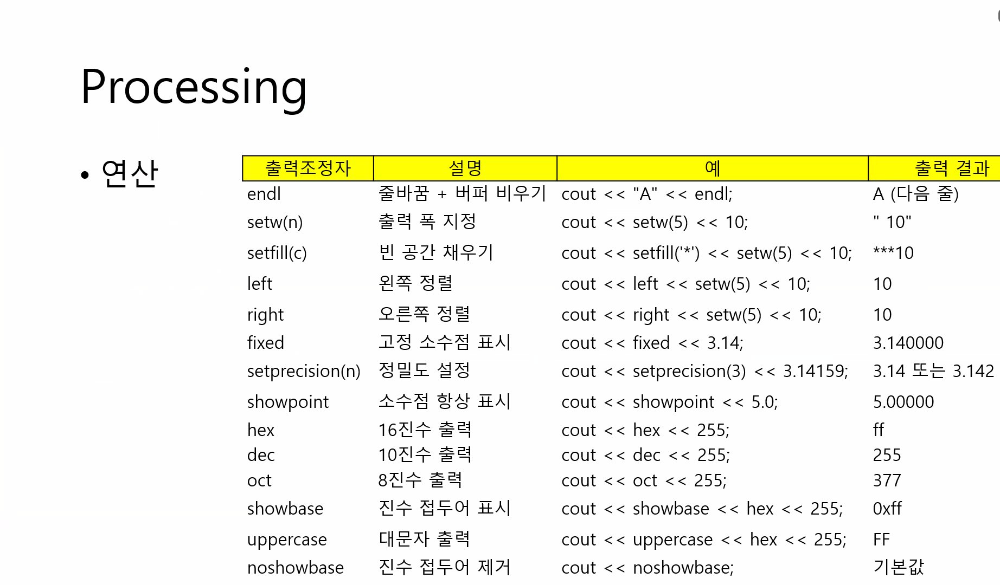

5. Condition(조건): [소스](./Day0306-Solution/basic2/04_condition.cpp)

    - 조건은 true/false 값
    - 조건이 참이면 if 블록 실행, 거짓이면 else 블록 실행
    - 여러 조건 → else if
    - 한 줄 조건 → 삼항 연산자
    - 여러 정수/문자 조건 → switch

    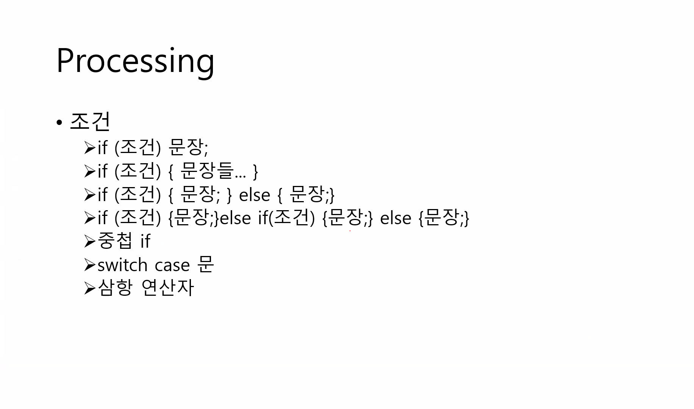

6. Loop(반복)

    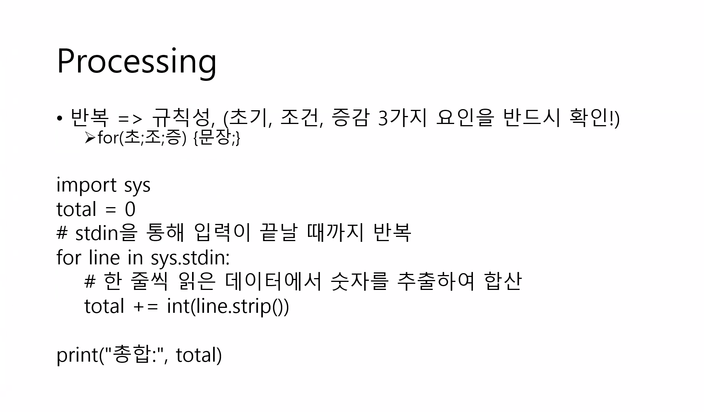

    - 규칙 찾기
    - 초기값, 조건, 증가

    1. for문 → 반복 횟수 정해짐: [소스](./Day0306-Solution/basic2/05_for.cpp)
    2. while문 → 조건이 참이면 반복: [소스](./Day0306-Solution/basic2/06_while.cpp)
    3. do while 문 → 최소 1번 실행 
    4. break → 반복문 종료: [소스](./Day0306-Solution/basic2/07_break_continue.cpp)
    5. continue → 다음 반복 진행
    6. return → 함수 종료

    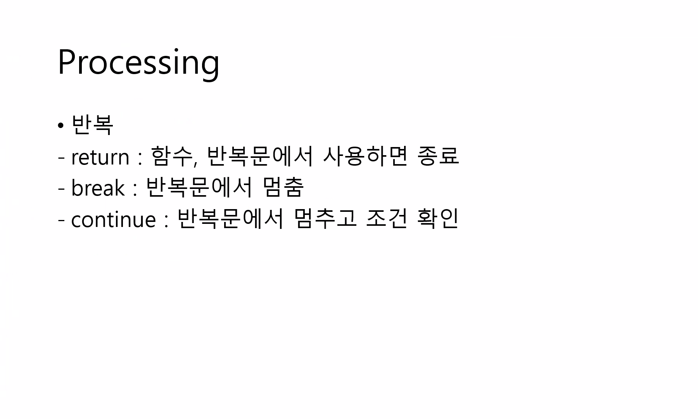

7. function(함수)

    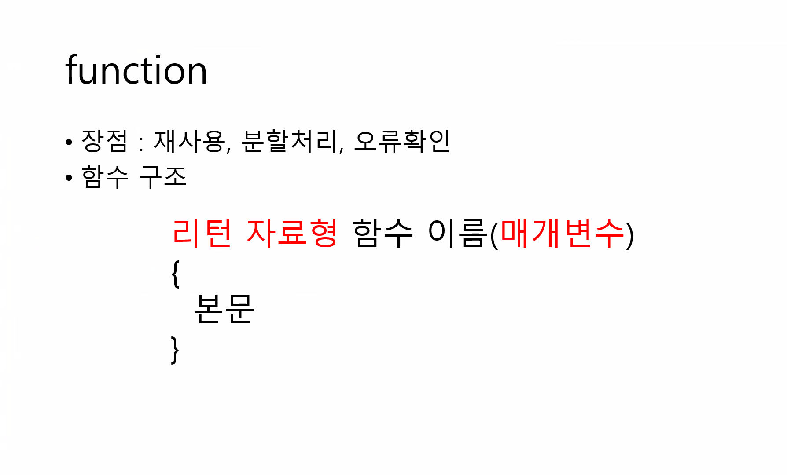

    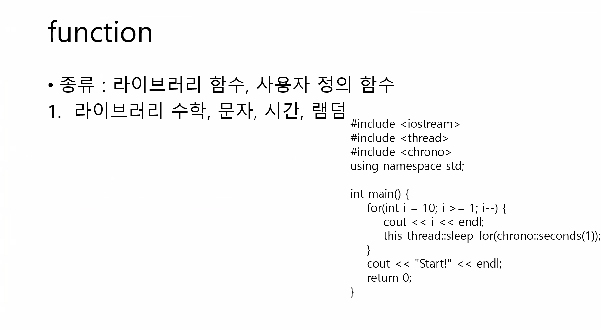

    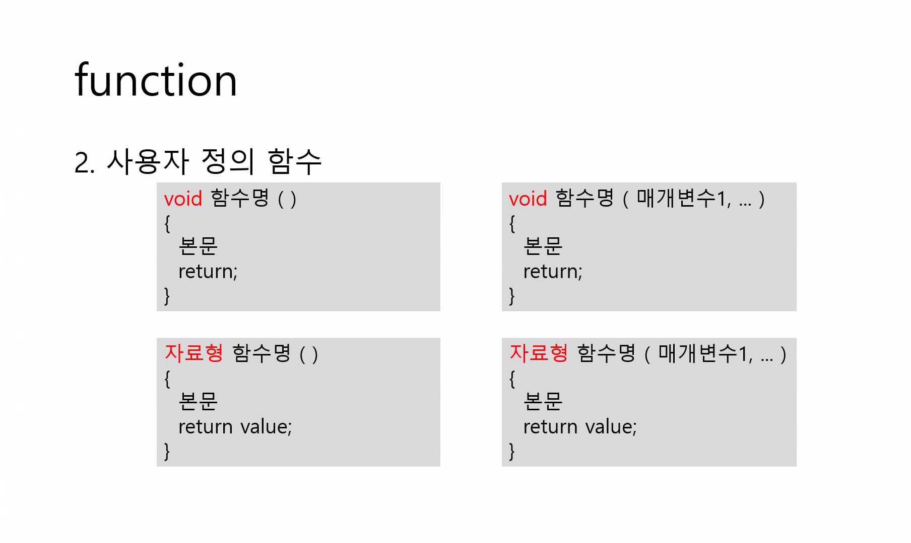

    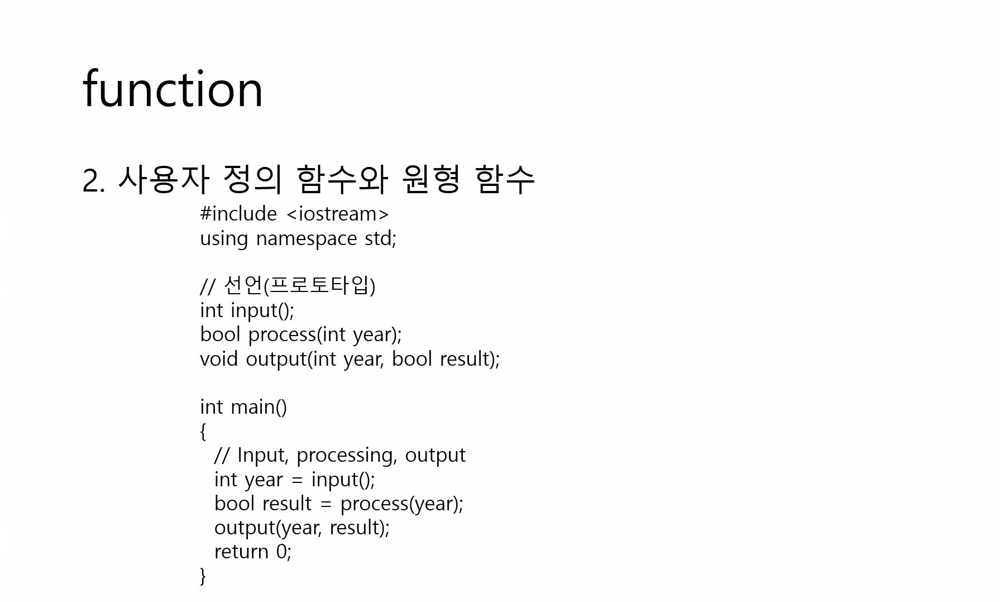

    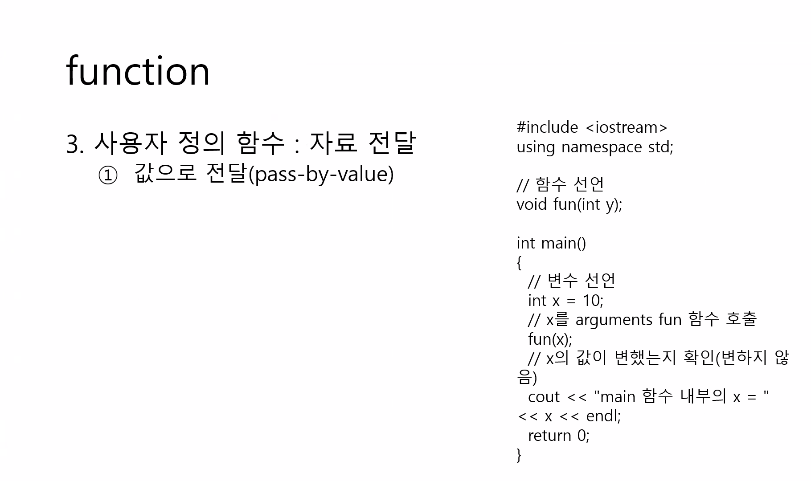

    